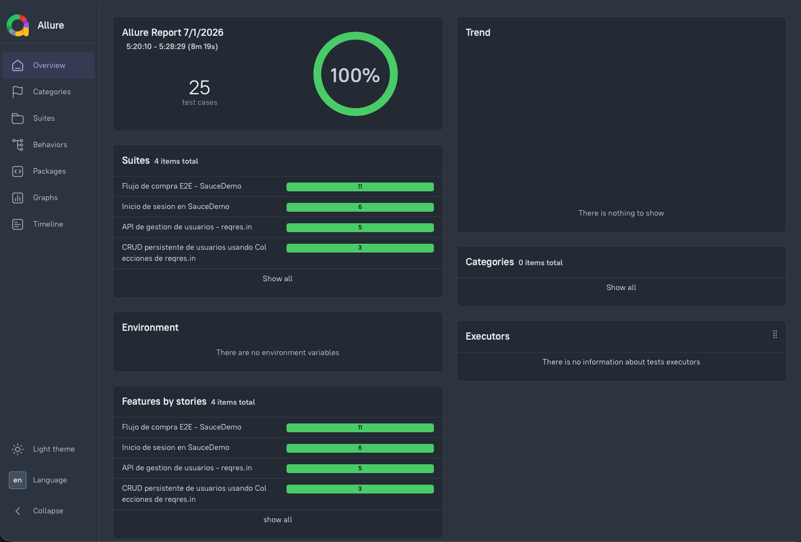
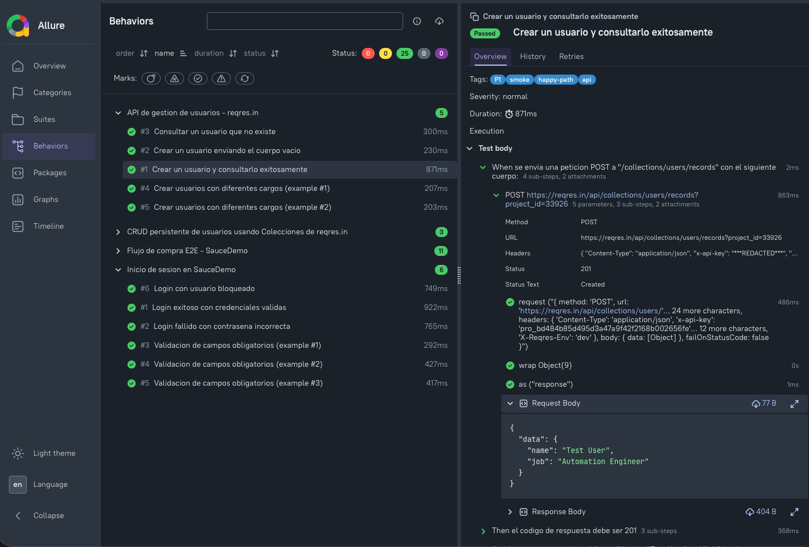
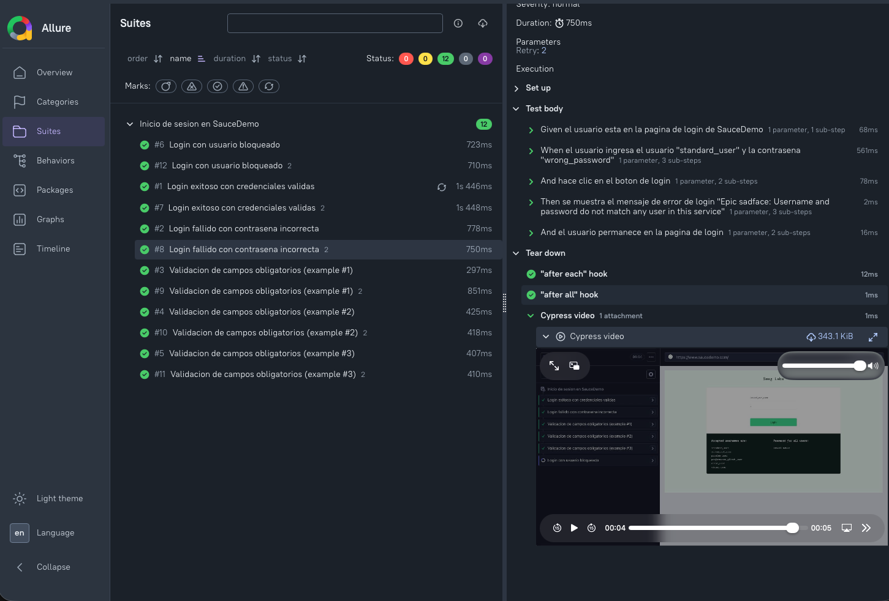
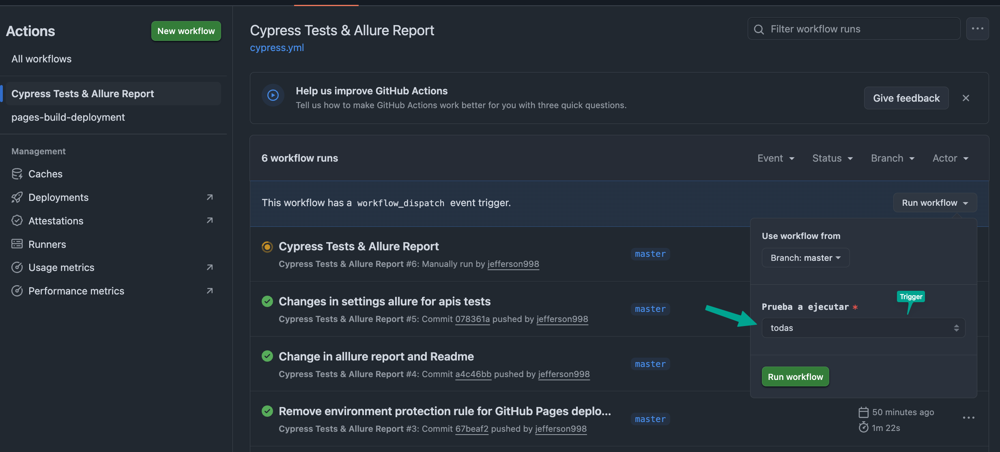

# Makers – Prueba Tecnica QA Automation

Automatizacion del Smoke Test de login (SauceDemo) y de la API de reqres.in, usando **Cypress + Cucumber (BDD)** con **reporte Allure**.

## Stack

- **TypeScript**
- Cypress 15
- @badeball/cypress-cucumber-preprocessor (Gherkin)
- @bahmutov/cypress-esbuild-preprocessor (bundler para los `.ts`)
- @shelex/cypress-allure-plugin + allure-commandline (reporte Allure)
- Page Object Model tipado para la parte web (`cypress/pages`)

## Estructura del proyecto

```
cypress/
  e2e/features/
    login.feature              # Smoke test de login SauceDemo
    api.feature                 # Pruebas funcionales API reqres.in
    api-crud-persistente.feature
    compra.feature
  pages/
    LoginPage.ts                 # Page Object del login
    InventoryPage.ts
    CartPage.ts
    CheckoutPage.ts
  support/
    e2e.ts
    step_definitions/
      login.steps.ts
      compra.steps.ts
      api.steps.ts
      collections.steps.ts
cypress.config.ts
tsconfig.json
.cypress-cucumber-preprocessorrc.json
package.json
```

## Instalacion

```bash
npm install
```

## Ejecucion

```bash
# Correr todo el suite (login + api)
npm test

# Correr solo login
npm run test:login

# Correr solo api
npm run test:api

# Modo interactivo
npm run cy:open
```

## Generar y abrir el reporte Allure

```bash
npm run allure:generate
npm run allure:open
```

O en un solo paso (ejecuta pruebas + genera + abre reporte):

```bash
npm run report
```

Los resultados crudos se guardan en `allure-results/` y el reporte HTML en `allure-report/`.


## Buenas practicas aplicadas

- **BDD con Gherkin**: escenarios legibles por negocio (`Given/When/Then`), reutilizables via `Background` y `Scenario Outline` para variar datos sin duplicar pasos.
- **Page Object Model**: separa selectores/acciones de la logica de aserciones, facilita mantenimiento ante cambios de UI.
- **Tags** (`@happy-path`, `@alterno`, `@negativo`, `@smoke`) para poder filtrar ejecucion por tipo de prueba.
- **Independencia de pruebas**: cada escenario visita el login desde cero (Background) o crea su propio usuario en la API, sin depender del orden de ejecucion.
- **Reporte Allure**: trazabilidad de ejecucion, evidencias por paso y agrupacion por features/tags para el equipo y stakeholders.
- **Datos como variables de entorno** (`cypress.config.js env`) para no exponer credenciales hardcodeadas repetidas en cada step.


## Caso funcional implementado en el PDF

[Caso funcional.pdf](./Caso%20funcional.pdf)


## Reporte de Automatización

[Reporte Allure](https://jefferson998.github.io/PruebaQa/allure-report/)

Imagenes de Reporte Allure




Pipeline de GitHub Actions
